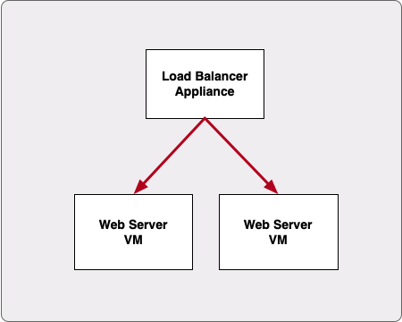
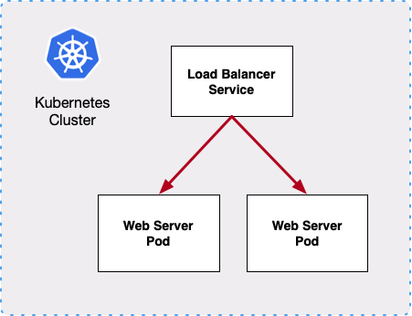

# Simple nginx Microservice

## Overview

This is meant to be a simple tutorial of a Kubernetes cluster containing an nginx webserver with a load balancer. The deployment is scaled to demonstrate the scaling and automatic load balancing features of Kubernetes.

## Kubernetes Concepts

The steps below will cover the following:

- Setup a local cluster for development
- Use a ConfigMap to manage a configuration file
- Deployment of a container image and scaling replicas
- Create a load balancer service
- View container logs
- Importance of software-defined network integrations with Kubernetes

## Architecture

### Traditional



### Kubernetes

While this example is extremely oversimplified, it illustrates the similarity in architectures for a very common use case.  The main difference is in Kubernetes, everything is software defined and can be setup and destroyed in minutes (or less).



Instead of running workloads directly on VMs, Kubernetes uses pods, which is where the containers are deployed.  Instead of a physical load balancer, this example uses a Kubernetes service setup as a load balancer.  In more sophisticated deployments, the pods would be spread across multiple Kubernetes worker nodes.  Cloud providers have different options for ingress, container networking (CNI), and load balancing.

## Prerequisites

1. Install [MicroK8s](https://microk8s.io/docs/getting-started) (specific steps [here](./assets/microk8s.md)).  [Docker Desktop](https://www.docker.com/products/docker-desktop) can be used on MacOS, but the ingress controller is not needed.
2. It is assumed the Git client is already installed to be able to clone this repository.  Alternatively, the Git repository can be downloaded in a zip or tar file and extracted locally.

## Verify Kubernetes

Once Kubernetes is setup, run kubectl commands to get basic information about the cluster, configuration, and deployed resources:

```
kubectl cluster-info
kubectl config view
kubectl get pods --namespace=kube-system
kubectl get pods -A
kubectl get pv
kubectl get pvc
kubectl get deploy -A
kubectl get svc -A
```

## Clone git repo

Clone git repository ([git client](https://git-scm.com/downloads) required) and cd to repo directory.

```
$ git clone https://github.com/k8s-nginx.git
$ cd k8s-nginx
```

## Example of load balanced nginx web servers

For each kubectl apply commands in the following steps, cat the YAML file to see the defined resources.

### ConfigMap

The ConfigMap is used to store the nginx configuration file as a cluster resource.

```
$ kubectl apply -f nginx-configmap.yml
configmap/nginx-conf created
```

List configmap.

```
$ kubectl get configmap
NAME         DATA   AGE
nginx-conf   1      5s
```

### Deployment

The deployment resource is used to manage the lifecycle of the container instances.

```
$ kubectl apply -f nginx-deployment.yml
deployment.apps/nginx created
```

Get deployment information.

```
$ kubectl get deploy
NAME    READY   UP-TO-DATE   AVAILABLE   AGE
nginx   1/1     1            1           7m
```

Get pod information.  -o wide is commonly used to see other common fields.  -o yaml is commonly used to show all details.

```
$ kubectl get pods
NAME                     READY   STATUS    RESTARTS   AGE
nginx-7cbfb5989c-pmgff   1/1     Running   0          7m43s
$ kubectl get pods -o wide
NAME                     READY   STATUS    RESTARTS   AGE     IP          NODE             NOMINATED NODE   READINESS GATES
nginx-7cbfb5989c-pmgff   1/1     Running   0          7m47s   10.1.0.46   docker-desktop   <none>           <none>
```

### Service

The service creates a persistent internal cluster IP address to reference the pods, even if the pods are rescheduled and their IP addresses change.

```
$ kubectl apply -f nginx-service.yml
service/nginx created
```

Get the external IP address name) of the allocated load balancer for nginx.

```
$ kubectl get svc
NAME         TYPE           CLUSTER-IP       EXTERNAL-IP   PORT(S)        AGE
kubernetes   ClusterIP      10.96.0.1        <none>        443/TCP        6d3h
nginx        LoadBalancer   10.109.197.139   localhost     80:30988/TCP   5s
```

### Ingress

Ingress exposes the internal cluster IP so it can be accessed outside the cluster.

```
$ kubectl apply -f nginx-ingress.yml
ingress.networking.k8s.io/nginx-ingress created
```

Get the external IP address name) of the allocated load balancer for nginx.

```
$ k get ingress
NAME            CLASS    HOSTS   ADDRESS     PORTS   AGE
nginx-ingress   public   *       127.0.0.1   80      5m32s
```

### Test using curl

From another console window, make HTTP requests to the application using the external IP address obtained in the previous step.

```
$ curl localhost:80
nginx-7cbfb5989c-pmgff
$ curl localhost:80
nginx-7cbfb5989c-pmgff
```

### View logs

From the console window for kubectl, use the pod name to check the pod's logs.

```
$ kubectl logs nginx-7cbfb5989c-pmgff
2020/03/27 14:48:14 [notice] 1#1: using the "epoll" event method
2020/03/27 14:48:14 [notice] 1#1: nginx/1.17.9
2020/03/27 14:48:14 [notice] 1#1: built by gcc 8.3.0 (Debian 8.3.0-6)
2020/03/27 14:48:14 [notice] 1#1: OS: Linux 4.19.76-linuxkit
2020/03/27 14:48:14 [notice] 1#1: getrlimit(RLIMIT_NOFILE): 1048576:1048576
2020/03/27 14:48:14 [notice] 1#1: start worker processes
2020/03/27 14:48:14 [notice] 1#1: start worker process 7
192.168.65.3 - - [27/Mar/2020:14:48:24 +0000] "GET / HTTP/1.1" 200 23 "-" "curl/7.54.0" "-"
2020/03/27 14:48:24 [info] 7#7: *1 client 192.168.65.3 closed keepalive connection
192.168.65.3 - - [27/Mar/2020:14:48:25 +0000] "GET / HTTP/1.1" 200 23 "-" "curl/7.54.0" "-"
2020/03/27 14:48:25 [info] 7#7: *2 client 192.168.65.3 closed keepalive connection
192.168.65.3 - - [27/Mar/2020:14:48:26 +0000] "GET / HTTP/1.1" 200 23 "-" "curl/7.54.0" "-"
```

### Generate load

From the console window where curl was run, run curl in an infinite loop.

```
$ while true; do curl -s http://localhost:80; done
nginx-7cbfb5989c-pmgff
nginx-7cbfb5989c-pmgff
nginx-7cbfb5989c-pmgff
```

### Scale deployment

Scale the replicas to 2 and monitor the curl loop in the other window from the previous step.

```
$ kubectl scale --replicas=2 deployment/nginx
deployment.extensions/nginx scaled
```

Get pod names.  The status of the new pod will change as it is created, passes the readinessProbe, and becomes ready.

```
$ kubectl get pods
NAME                     READY   STATUS    RESTARTS   AGE
nginx-7cbfb5989c-pmgff   1/1     Running   0          31s
nginx-864f7bbfbf-jj4xt   1/1     Running   0          10s
```

### Generate load to check load balancing

From the console window where curl was run, run curl in an infinite loop.  The output should indicate multiple pods are being accessed.

```
$ while true; do curl -s http://localhost:80; done
nginx-7cbfb5989c-pmgff
nginx-864f7bbfbf-jj4xt
nginx-7cbfb5989c-pmgff
nginx-864f7bbfbf-jj4xt
nginx-7cbfb5989c-pmgff
nginx-864f7bbfbf-jj4xt
```

### Delete a pod

Delete a pod while monitoring the curl loop.

```
$ kubectl delete pod <pod_name>
pod "nginx-7cbfb5989c-tx4tc" deleted
```

In the console window where curl is running in an infinite loop, instead of seeing both pod names in the output, traffic should only be sent to one pod.  Since the deployment was set to have 2 replicas, the deleted pod will be replaced by a new pod.  Once the readinessProbe succeeds, the curl command should indicate traffic is accessing also hitting the new pod name.

### Cleanup

```
$ kubectl delete ingress nginx-ingress
ingress.networking.k8s.io "nginx-ingress" deleted
$ kubectl delete svc nginx
service "nginx" deleted
$ kubectl delete deploy nginx
deployment.extensions "nginx" deleted
$ kubectl delete configmap nginx-conf
configmap "nginx-conf" deleted
```

As an alternative to the kubectl delete commands above, it is also possible to delete resources using the manifest file used to create them (-f option).  YAML files can contain multiple YAML documents separated by a triple-dash line ("---"), which would allow adding or removing the entire application with a single command.

```
$ kubectl delete -f nginx-ingress.yml
ingress.networking.k8s.io "nginx-ingress" deleted
$ kubectl delete -f nginx-service.yml
service "nginx" deleted
$ kubectl delete -f nginx-deployment.yml
deployment.extensions "nginx" deleted
$ kubectl delete -f nginx-configmap.yml
configmap "nginx-conf" deleted
```
